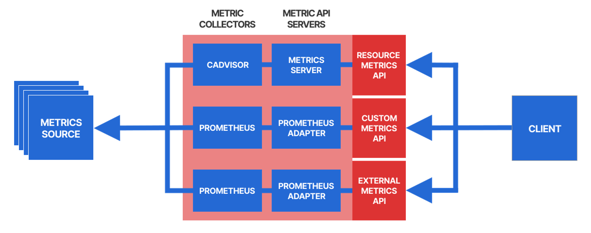
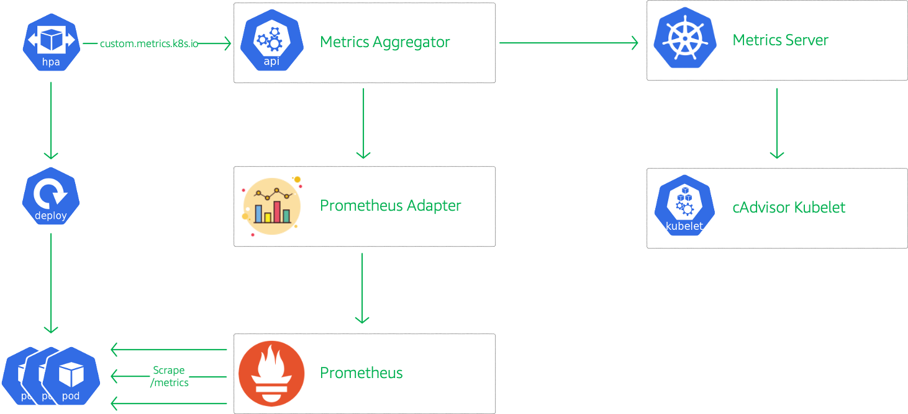
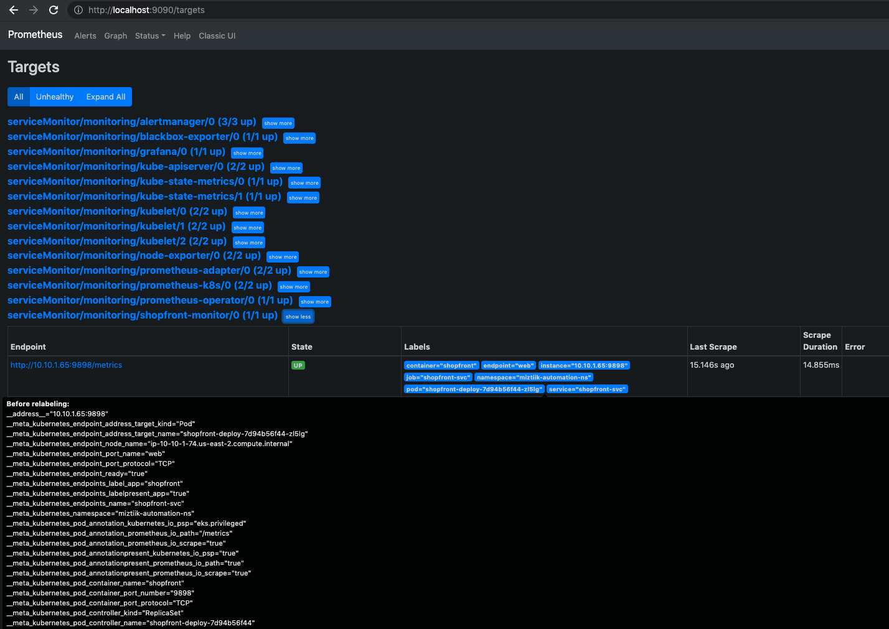

# Kubernetes(EKS) - Scale applications with custom metrics

The developer at Mystique Unicorn are interested in building their application using event-driven architectural pattern to process streaming data. For those who are unfamiliar, _An event-driven architecture uses events to trigger and communicate between decoupled services and is common in modern applications built with microservices. An event is a change in state, or an update, like an item being placed in a shopping cart on an e-commerce website._

To maximize efficiency, they would like to have a mechanism to dynamically scale resources based on the incoming requests demands. That if there is more requests on a particular service, they would like to scale the application based on the number of requests over the past five minutes.

Can you help them?

## 🎯 Solutions

We rely on the Kubernetes Horizontal Pod Autoscaler (HPA) to scale services in a reliable, predictable, and controllable manner.

- **How the Horizontal Pod Autoscaler works by using custom metrics**

The Horizontal Pod Autoscaler (HPA) allows to automatically scale workloads up or down based on the resource usage. By default, the HPA policy automatically scales the number of pods based on the observed CPU utilization. However,in many situations, you might want to scale the application based on other monitored metrics, such as the number of incoming requests or the memory consumption. In Kubernetes you have access to different types of metrics:

- **Resource Metrics API**: predefined resource usage metrics (CPU and memory) of Pods and Nodes
- **Custom Metrics API**: custom metrics associated with a Kubernetes object
- **External Metrics API**: custom metrics not associated with a Kubernetes object



The HPA controller can periodically(_default 15 seconds_) monitor a metric about an app and continuously adjust the number of replicas to optimally meet the current demand. The goal is to calculate a replica count that brings the metric value as close as possible to the target value. During each run, The controller manager obtains the metrics from either the resource metrics API (for per-pod resource metrics), or the custom metrics API (for all other metrics).

The Custom Metrics API is a framework for exposing arbitrary metrics like _latency_ as Kubernetes API metrics. It allows them to appear via `/apis/custom.metrics.k8s.io/` and be fetched internally by HPA. For example, Let us say the scaling metric is the requests-per-second(rps) per replica:

- If the target value is `100rps` and the current value is `200rps`, the HPA will scale up
- If the target value is `50rps` and the current value is `5rps`, the HPA will scale down

To expose these metrics to the HPA, We need a metrics collector that collects the desired metrics from the sources (e.g. from the Pods of the target app) and provides them to the metric API server.

- **Resource Metrics API:** The official metric API server for the Resource Metrics API is the Metrics Server, But by default, the metric API servers are _not_ installed in Kubernetes, which means that the metric APIs are not enabled by default. When installed, The server uses as _cAdvisor_ the collector, which runs as part of the _kubelet_ on every worker node (so it's already installed by default)

- **Custom Metrics API and External Metrics API:** The most popular choice for custom and external metrics collection is Prometheus. The _Prometheus Adapter_ is a metric API server that integrates with Prometheus

To expose a custom metric through one of the metric APIs, we need to do the following,

1. Install a metrics collector (e.g. Prometheus<sup>[1]</sup>) and configure it to collect the desired metric (e.g. rps of the Pods for your app)
1. Install a metric API server (e.g. the Prometheus Adapter<sup>[2]</sup>) and configure it to expose from the metrics collector through the corresponding metrics API

In this blog, I will show you how to setup autoscaling for an application using a custom metric like _requests per second_ for an app using prometheus adapater.

- Create a deployment that exposes the total number of received requests as a Prometheus metric
- Install Prometheus and configure it to collect this metric from all the Pods of your app
- Install the Prometheus Adapter and configure it to turn the metric from Prometheus into a per-second request rate (using PromQL) and expose that metric as `http_requests_per_second` through the Custom Metrics API
- Create a HorizontalPodAutoscaler resource `http_requests_per_second` as the scaling metric and an appropriate target value



1. ## 🧰 Prerequisites

   This demo, instructions, scripts and cloudformation template is designed to be run in `us-east-1`. With few modifications you can try it out in other regions as well(_Not covered here_).

   - 🛠 AWS CLI Installed & Configured - [Get help here](https://youtu.be/TPyyfmQte0U)
   - 🛠 AWS CDK Installed & Configured - [Get help here](https://www.youtube.com/watch?v=MKwxpszw0Rc)
   - 🛠 Python Packages, _Change the below commands to suit your OS, the following is written for amzn linux 2_
     - Python3 - `yum install -y python3`
     - Python Pip - `yum install -y python-pip`
     - Virtualenv - `pip3 install virtualenv`

1. ## ⚙️ Setting up the environment

   - Get the application code

     ```bash
     git clone https://github.com/miztiik/eks-scaling-with-prometheus
     cd eks-scaling-with-prometheus
     ```

1. ## 🚀 Prepare the dev environment to run AWS CDK

   We will use `cdk` to make our deployments easier. Lets go ahead and install the necessary components.

   ```bash
   # You should have npm pre-installed
   # If you DONT have cdk installed
   npm install -g aws-cdk

   # Make sure you in root directory
   python3 -m venv .venv
   source .venv/bin/activate
   pip3 install -r requirements.txt
   ```

   The very first time you deploy an AWS CDK app into an environment _(account/region)_, you’ll need to install a `bootstrap stack`, Otherwise just go ahead and deploy using `cdk deploy`.

   ```bash
   cdk bootstrap
   cdk ls
   # Follow on screen prompts
   ```

   You should see an output of the available stacks,

   ```bash
   eks-cluster-vpc-stack-01
   eks-cluster-stack-01
   ssm-agent-installer-daemonset-stack-01
   ```

1. ## 🚀 Deploying the application

   Let us walk through each of the stacks,

   - **Stack: eks-cluster-vpc-stack-01**
     To host our EKS cluster we need a custom VPC. This stack will build a multi-az VPC with the following attributes,

     - **VPC**:
       - 2-AZ Subnets with Public, Private and Isolated Subnets.
       - 1 NAT GW for internet access from private subnets

     Initiate the deployment with the following command,

     ```bash
     cdk deploy eks-cluster-vpc-stack-01
     ```

     After successfully deploying the stack, Check the `Outputs` section of the stack for the

   - **Stack: eks-cluster-stack-01**
     As we are starting out a new cluster, we will use most default. No logging is configured or any add-ons. The cluster will have the following attributes,

     - The control pane is launched with public access. _i.e_ the cluster can be access without a bastion host
     - `c_admin` IAM role added to _aws-auth_ configMap to administer the cluster from CLI.
     - One **OnDemand** managed EC2 node group created from a launch template
       - It create two `t3.medium` instances running `Amazon Linux 2`.
       - Auto-scaling Group with `2` desired instances.
       - The nodes will have a node role attached to them with `AmazonSSMManagedInstanceCore` permissions
       - Kubernetes label `app:miztiik_on_demand_ng`

     The EKS cluster will be created in the custom VPC created earlier. Initiate the deployment with the following command,

     ```bash
     cdk deploy eks-cluster-stack-01
     ```

     After successfully deploying the stack, Check the `Outputs` section of the stack. You will find the `**ConfigCommand**` that allows yous to interact with your cluster using `kubectl`

   - **Stack: ssm-agent-installer-daemonset-stack-01**
     This EKS AMI used in this stack does not include the AWS SSM Agent out of the box. If we ever want to patch or run something remotely on our EKS nodes, this agent is really helpful to automate those tasks. We will deploy a daemonset that will _run exactly once?_ on each node using a cron entry injection that deletes itself after successful execution. If you are interested take a look at the daemonset manifest here `stacks/back_end/eks_cluster_stacks/eks_ssm_daemonset_stack/eks_ssm_daemonset_stack.py`. This is inspired by this AWS guidance.

     Initiate the deployment with the following command,

     ```bash
     cdk deploy ssm-agent-installer-daemonset-stack-01
     ```

     After successfully deploying the stack, You can connect to the worker nodes instance using SSM Session Manager.

1. ## 🔬 Testing the solution

   1. **Install Prometheus & Prometheus Adapter**

      There are many ways to install Prometheus - using manifests, helm. we will be using the kube-prometheus stack and use a custom created namespace `monitoring`

      Deploy the manifest,

      ```bash
      kubectl create namespace monitoring

      git clone https://github.com/prometheus-operator/kube-prometheus kube-prometheus
      cd kube-prometheus

      # Create the monitoring stack using the config in the manifests directory:
      # Create the namespace and CRDs, and then wait for them to be available before creating the remaining resources
      kubectl create -f manifests/setup
      until kubectl get servicemonitors --all-namespaces ; do date; sleep 1; echo ""; done
      kubectl create -f manifests/
      ```

      Check the prometheus stack rollout status,

      ```bash
      kubectl rollout status deploy/prometheus-adapter --namespace monitoring
      ```

      Expected output,

      ```bash
      # kubectl rollout status deploy/prometheus-operator --namespace monitoring
      deployment "prometheus-operator" successfully rolled out
      # kubectl rollout status deploy/prometheus-adapter --namespace monitoring
      deployment "prometheus-adapter" successfully rolled out
      # kubectl get pods --namespace monitoring
      NAME                                   READY   STATUS    RESTARTS   AGE
      alertmanager-main-0                    2/2     Running   0          2d21h
      alertmanager-main-1                    2/2     Running   0          2d21h
      alertmanager-main-2                    2/2     Running   0          2d21h
      blackbox-exporter-6c95587d7-k942x      3/3     Running   0          2d21h
      grafana-6ccd8d89f8-8vzjr               1/1     Running   0          2d21h
      kube-state-metrics-b545789dd-bh9qc     3/3     Running   0          2d21h
      node-exporter-br8vg                    2/2     Running   0          2d21h
      node-exporter-h8ztr                    2/2     Running   0          2d21h
      prometheus-adapter-5df846c94f-9trs5    1/1     Running   0          2d20h
      prometheus-adapter-5df846c94f-qn5wx    1/1     Running   0          2d20h
      prometheus-k8s-0                       2/2     Running   0          2d21h
      prometheus-k8s-1                       2/2     Running   0          2d21h
      prometheus-operator-754b59fc78-9zkct   2/2     Running   0          2d21h
      ```

      1. **Apply Cluster Role RBAC to Prometheus to monitor other namespaces**

      We need to give prometheus permissions to monitor namespaces other than `default`. A sample manifest of the cluster role permissions for prometheus is given in this directory `stacks/k8s_utils/manifests/k8s_cluster_role_rbac_perms.yaml`

      ```bash
      kubectl apply -f k8s_cluster_role_rbac_perms.yaml
      ```

      1. **Register Custom Metrics API**

      We need to expose custom metrics as API endpoint. We do by adding configuration for the custom metrics API using this manifest `stacks/k8s_utils/manifests/custom-metrics-apiservice.yaml`

      ```bash
      kubectl apply -f custom-metrics-apiservice.yaml
      ```

      1. **Add Custom Metrics to Prometheus Adapter configmap**

      We need to inform prometheus adapter that it has to aggregate and expose a custom metric like `http_requests_count`. A sample is shown here

      ```promql
      - seriesQuery: 'http_requests_total{namespace!="",pod!=""}'
        resources:
          overrides:
            namespace:
              resource: namespace
            pod:
              resource: pod
        name:
          matches: "^(.*)_total"
          as: "${1}_per_second"
        metricsQuery: 'sum(rate(<<.Series>>{<<.LabelMatchers>>}[2m])) by (<<.GroupBy>>)'
      ```

      A more detailed example can be found here[3].

      ```bash
      # kubectl edit cm prometheus-adapter --namespace monitoring
      kubectl apply -f custom-metrics-config.yaml
      ```

      Let us verify our configurations have been done correctly so far,

      ```bash
      # kubectl get apiservices v1beta1.metrics.k8s.io
      NAME                     SERVICE                      AVAILABLE   AGE
      v1beta1.metrics.k8s.io   kube-system/metrics-server   True        41h
      # kubectl get apiservices v1beta1.custom.metrics.k8s.io
      NAME                            SERVICE                         AVAILABLE   AGE
      v1beta1.custom.metrics.k8s.io   monitoring/prometheus-adapter   True        7m56s

      # You can also infer additional information about the API service by describing it.
      # kubectl describe apiservice v1beta1.custom.metrics.k8s.io
      ```

      Make sure both of them are available with value of `TRUE`

      Explore the available Resource Metrics for nodes and pods

      ```bash
      # Get more metrics about nodes
      kubectl get --raw /apis/metrics.k8s.io/v1beta1/nodes | jq

      # Get more details about pods
      kubectl get --raw /apis/metrics.k8s.io/v1beta1/pods | jq
      ```

      1. **Deploy Our Shopfront Application**

      The app will deploy a sample service using the open source container image from, `stefanprodan/podinfo:0.0.1`. This app exposes metrics about the pods on `/metrics` path. The deployment also setups a HPA with that will scale the app to a maximum of `3` replicas when average incoming requests is >= `2` requests per second.

      To allow our HPA to fetch the custom metrics, the manifest will create Kubernetes Custom Resource Definition(CRD) for a ServiceMonitor in the `monitoring` namespace. What this does is that, It informs the Prometheus to scrape custom metrics from our service endpoint. We provide the path `/metrics` and any custom ports the metrics are exposed.

      We will be deploying the application in a separate namespace `miztiik-automation-ns`. These manifest files are under `stacks/k8s_utils/manifests/`

      ```bash
      kubectl apply -f miztiik-automation-ns.yml
      kubectl apply -f shopfront.yml
      ```

      Wait for few minutes and check the custom metrics API for our metric,

      ```bash
      kubectl get --raw "/apis/custom.metrics.k8s.io/v1beta1/" | jq .
      # kubectl get --raw "/apis/custom.metrics.k8s.io/v1beta1" | jq .  |grep "pods/"
      ```

      Expected output,

      ```json
      {
        "kind": "APIResourceList",
        "apiVersion": "v1",
        "groupVersion": "custom.metrics.k8s.io/v1beta1",
        "resources": [
          {
            "name": "namespaces/http_requests_per_second",
            "singularName": "",
            "namespaced": false,
            "kind": "MetricValueList",
            "verbs": ["get"]
          },
          {
            "name": "pods/http_requests_per_second",
            "singularName": "",
            "namespaced": true,
            "kind": "MetricValueList",
            "verbs": ["get"]
          }
        ]
      }
      ```

      Get the service url,

      ```bash
      kubectl get svc shopfront-svc -n miztiik-automation-ns -o jsonpath='{.status.loadBalancer.ingress[].hostname}'
      ```

      Generate some requests against our service and check out the exposed metrics available on this url `/metrics`

      ```bash
      curl a6ef25efb573547e7a6e575f01302dc5-808395243.us-east-2.elb.amazonaws.com
      ```

      Expected Output,

      ```bash
      runtime:
        arch: amd64
        external_ip: 18.224.3.230
        max_procs: "2"
        num_cpu: "2"
        num_goroutine: "10"
        os: linux
        version: go1.9.2
      environment:
        HOME: /root
        HOSTNAME: shopfront-deploy-7d94b56f44-fblvd
        KUBERNETES_PORT: tcp://172.20.0.1:443
        KUBERNETES_PORT_443_TCP: tcp://172.20.0.1:443
        KUBERNETES_PORT_443_TCP_ADDR: 172.20.0.1
        KUBERNETES_PORT_443_TCP_PORT: "443"
        KUBERNETES_PORT_443_TCP_PROTO: tcp
        KUBERNETES_SERVICE_HOST: 172.20.0.1
        KUBERNETES_SERVICE_PORT: "443"
        KUBERNETES_SERVICE_PORT_HTTPS: "443"
        PATH: /usr/local/sbin:/usr/local/bin:/usr/sbin:/usr/bin:/sbin:/bin
        SHOPFRONT_SVC_PORT: tcp://172.20.92.205:80
        SHOPFRONT_SVC_PORT_80_TCP: tcp://172.20.92.205:80
        SHOPFRONT_SVC_PORT_80_TCP_ADDR: 172.20.92.205
        SHOPFRONT_SVC_PORT_80_TCP_PORT: "80"
        SHOPFRONT_SVC_PORT_80_TCP_PROTO: tcp
        SHOPFRONT_SVC_SERVICE_HOST: 172.20.92.205
        SHOPFRONT_SVC_SERVICE_PORT: "80"
        SHOPFRONT_SVC_SERVICE_PORT_WEB: "80"
      ```

      Accessing the metrics,

      ```bash
      curl a6ef25efb573547e7a6e575f01302dc5-808395243.us-east-2.elb.amazonaws.com/metrics
      ```

      Expected Output,

      ```bash
      # HELP go_gc_duration_seconds A summary of the GC invocation durations.
      # TYPE go_gc_duration_seconds summary
      go_gc_duration_seconds{quantile="0"} 2.4496e-05
      go_gc_duration_seconds{quantile="0.25"} 4.4314e-05
      go_gc_duration_seconds{quantile="0.5"} 5.4061e-05
      go_gc_duration_seconds{quantile="0.75"} 7.9559e-05
      go_gc_duration_seconds{quantile="1"} 0.000171015
      go_gc_duration_seconds_sum 0.00234783
      go_gc_duration_seconds_count 36
      # HELP go_goroutines Number of goroutines that currently exist.
      # TYPE go_goroutines gauge
      go_goroutines 16
      # HELP go_memstats_alloc_bytes Number of bytes allocated and still in use.
      # TYPE go_memstats_alloc_bytes gauge
      go_memstats_alloc_bytes 1.426992e+06
      # HELP go_memstats_alloc_bytes_total Total number of bytes allocated, even if freed.
      # TYPE go_memstats_alloc_bytes_total counter
      go_memstats_alloc_bytes_total 1.02099e+08
      # HELP go_memstats_buck_hash_sys_bytes Number of bytes used by the profiling bucket hash table.
      # TYPE go_memstats_buck_hash_sys_bytes gauge
      go_memstats_buck_hash_sys_bytes 1.450085e+06
      # HELP go_memstats_frees_total Total number of frees.
      # TYPE go_memstats_frees_total counter
      go_memstats_frees_total 156622
      # HELP go_memstats_gc_sys_bytes Number of bytes used for garbage collection system metadata.
      # TYPE go_memstats_gc_sys_bytes gauge
      go_memstats_gc_sys_bytes 405504
      # HELP go_memstats_heap_alloc_bytes Number of heap bytes allocated and still in use.
      # TYPE go_memstats_heap_alloc_bytes gauge
      go_memstats_heap_alloc_bytes 1.426992e+06
      # HELP go_memstats_heap_idle_bytes Number of heap bytes waiting to be used.
      # TYPE go_memstats_heap_idle_bytes gauge
      go_memstats_heap_idle_bytes 3.588096e+06
      # HELP go_memstats_heap_inuse_bytes Number of heap bytes that are in use.
      # TYPE go_memstats_heap_inuse_bytes gauge
      go_memstats_heap_inuse_bytes 2.146304e+06
      # HELP go_memstats_heap_objects Number of allocated objects.
      # TYPE go_memstats_heap_objects gauge
      go_memstats_heap_objects 6028
      # HELP go_memstats_heap_released_bytes_total Total number of heap bytes released to OS.
      # TYPE go_memstats_heap_released_bytes_total counter
      go_memstats_heap_released_bytes_total 0
      # HELP go_memstats_heap_sys_bytes Number of heap bytes obtained from system.
      # TYPE go_memstats_heap_sys_bytes gauge
      go_memstats_heap_sys_bytes 5.7344e+06
      # HELP go_memstats_last_gc_time_seconds Number of seconds since 1970 of last garbage collection.
      # TYPE go_memstats_last_gc_time_seconds gauge
      go_memstats_last_gc_time_seconds 1.6277425097643597e+09
      # HELP go_memstats_lookups_total Total number of pointer lookups.
      # TYPE go_memstats_lookups_total counter
      go_memstats_lookups_total 1037
      # HELP go_memstats_mallocs_total Total number of mallocs.
      # TYPE go_memstats_mallocs_total counter
      go_memstats_mallocs_total 162650
      # HELP go_memstats_mcache_inuse_bytes Number of bytes in use by mcache structures.
      # TYPE go_memstats_mcache_inuse_bytes gauge
      go_memstats_mcache_inuse_bytes 3472
      # HELP go_memstats_mcache_sys_bytes Number of bytes used for mcache structures obtained from system.
      # TYPE go_memstats_mcache_sys_bytes gauge
      go_memstats_mcache_sys_bytes 16384
      # HELP go_memstats_mspan_inuse_bytes Number of bytes in use by mspan structures.
      # TYPE go_memstats_mspan_inuse_bytes gauge
      go_memstats_mspan_inuse_bytes 25384
      # HELP go_memstats_mspan_sys_bytes Number of bytes used for mspan structures obtained from system.
      # TYPE go_memstats_mspan_sys_bytes gauge
      go_memstats_mspan_sys_bytes 32768
      # HELP go_memstats_next_gc_bytes Number of heap bytes when next garbage collection will take place.
      # TYPE go_memstats_next_gc_bytes gauge
      go_memstats_next_gc_bytes 4.194304e+06
      # HELP go_memstats_other_sys_bytes Number of bytes used for other system allocations.
      # TYPE go_memstats_other_sys_bytes gauge
      go_memstats_other_sys_bytes 788627
      # HELP go_memstats_stack_inuse_bytes Number of bytes in use by the stack allocator.
      # TYPE go_memstats_stack_inuse_bytes gauge
      go_memstats_stack_inuse_bytes 557056
      # HELP go_memstats_stack_sys_bytes Number of bytes obtained from system for stack allocator.
      # TYPE go_memstats_stack_sys_bytes gauge
      go_memstats_stack_sys_bytes 557056
      # HELP go_memstats_sys_bytes Number of bytes obtained by system. Sum of all system allocations.
      # TYPE go_memstats_sys_bytes gauge
      go_memstats_sys_bytes 8.984824e+06
      # HELP http_requests Seconds spent serving HTTP requests.
      # TYPE http_requests histogram
      http_requests_bucket{method="GET",path="metrics",status="200",le="0.005"} 109
      http_requests_bucket{method="GET",path="metrics",status="200",le="0.01"} 109
      http_requests_bucket{method="GET",path="metrics",status="200",le="0.025"} 109
      http_requests_bucket{method="GET",path="metrics",status="200",le="0.05"} 109
      http_requests_bucket{method="GET",path="metrics",status="200",le="0.1"} 109
      http_requests_bucket{method="GET",path="metrics",status="200",le="0.25"} 109
      http_requests_bucket{method="GET",path="metrics",status="200",le="0.5"} 109
      http_requests_bucket{method="GET",path="metrics",status="200",le="1"} 109
      http_requests_bucket{method="GET",path="metrics",status="200",le="2.5"} 109
      http_requests_bucket{method="GET",path="metrics",status="200",le="5"} 109
      http_requests_bucket{method="GET",path="metrics",status="200",le="10"} 109
      http_requests_bucket{method="GET",path="metrics",status="200",le="+Inf"} 109
      http_requests_sum{method="GET",path="metrics",status="200"} 0.14396369199999998
      http_requests_count{method="GET",path="metrics",status="200"} 109
      http_requests_bucket{method="GET",path="root",status="200",le="0.005"} 0
      http_requests_bucket{method="GET",path="root",status="200",le="0.01"} 0
      http_requests_bucket{method="GET",path="root",status="200",le="0.025"} 0
      http_requests_bucket{method="GET",path="root",status="200",le="0.05"} 0
      http_requests_bucket{method="GET",path="root",status="200",le="0.1"} 1
      http_requests_bucket{method="GET",path="root",status="200",le="0.25"} 1
      http_requests_bucket{method="GET",path="root",status="200",le="0.5"} 1
      http_requests_bucket{method="GET",path="root",status="200",le="1"} 1
      http_requests_bucket{method="GET",path="root",status="200",le="2.5"} 1
      http_requests_bucket{method="GET",path="root",status="200",le="5"} 1
      http_requests_bucket{method="GET",path="root",status="200",le="10"} 1
      http_requests_bucket{method="GET",path="root",status="200",le="+Inf"} 1
      http_requests_sum{method="GET",path="root",status="200"} 0.06381686
      http_requests_count{method="GET",path="root",status="200"} 1
      # HELP http_requests_total The total number of HTTP requests.
      # TYPE http_requests_total counter
      http_requests_total{status="200"} 110
      # HELP process_cpu_seconds_total Total user and system CPU time spent in seconds.
      # TYPE process_cpu_seconds_total counter
      process_cpu_seconds_total 0.26
      # HELP process_max_fds Maximum number of open file descriptors.
      # TYPE process_max_fds gauge
      process_max_fds 1.048576e+06
      # HELP process_open_fds Number of open file descriptors.
      # TYPE process_open_fds gauge
      process_open_fds 10
      # HELP process_resident_memory_bytes Resident memory size in bytes.
      # TYPE process_resident_memory_bytes gauge
      process_resident_memory_bytes 1.097728e+07
      # HELP process_start_time_seconds Start time of the process since unix epoch in seconds.
      # TYPE process_start_time_seconds gauge
      process_start_time_seconds 1.62774223609e+09
      # HELP process_virtual_memory_bytes Virtual memory size in bytes.
      # TYPE process_virtual_memory_bytes gauge
      process_virtual_memory_bytes 1.4774272e+07
      ```

      1. **Access Prometheus GUI**

      You can explore the custom metric from the prometheus GUI as well. In a typical production setup, you will setup a loadbalancer for the service, Since we did not do that, we will forward the port locally and access it.

      ```bash
      kubectl --namespace monitoring port-forward svc/prometheus-k8s 9090 &
      ```

      

      1. **Check the Custom Metrics API for shopfront Metrics**

      ```bash
      kubectl get --raw /apis/custom.metrics.k8s.io/v1beta1/namespaces/miztiik-automation-ns/pods/*/http_requests_per_second | jq

      kubectl get --raw /apis/custom.metrics.k8s.io/v1beta1/namespaces/miztiik-automation-ns/pods/*/http_requests_per_second?labelSelector=app%3Dshopfront | jq
      ```

      Expected Output,

      ```json
      {
        "kind": "MetricValueList",
        "apiVersion": "custom.metrics.k8s.io/v1beta1",
        "metadata": {
          "selfLink": "/apis/custom.metrics.k8s.io/v1beta1/namespaces/miztiik-automation-ns/pods/%2A/http_requests_per_second"
        },
        "items": [
          {
            "describedObject": {
              "kind": "Pod",
              "namespace": "miztiik-automation-ns",
              "name": "shopfront-deploy-7d94b56f44-5hmc6",
              "apiVersion": "/v1"
            },
            "metricName": "http_requests_per_second",
            "timestamp": "2021-07-31T14:52:20Z",
            "value": "400m",
            "selector": null
          },
          {
            "describedObject": {
              "kind": "Pod",
              "namespace": "miztiik-automation-ns",
              "name": "shopfront-deploy-7d94b56f44-fblvd",
              "apiVersion": "/v1"
            },
            "metricName": "http_requests_per_second",
            "timestamp": "2021-07-31T14:52:20Z",
            "value": "400m",
            "selector": null
          },
          {
            "describedObject": {
              "kind": "Pod",
              "namespace": "miztiik-automation-ns",
              "name": "shopfront-deploy-7d94b56f44-w9fd7",
              "apiVersion": "/v1"
            },
            "metricName": "http_requests_per_second",
            "timestamp": "2021-07-31T14:52:20Z",
            "value": "400m",
            "selector": null
          }
        ]
      }
      ```

      _Note: Some of the values may seem higher than expected but note these are milli (m) units._

      1. **Generate Traffic against the service**

      We will use another pod to generate load against our shopfront, thereby triggering our HPA. Use one terminal to watch the HPA in action and generate the load in another terminal.

      Watch the HPA events,

      ```bash
      # kubectl get hpa shopfront-hpa -n miztiik-automation-ns --watch
      NAME            REFERENCE                     TARGETS   MINPODS   MAXPODS   REPLICAS   AGE
      shopfront-hpa   Deployment/shopfront-deploy   400m/2    1         3         1          2d22h
      ....
      ```

      Initiate load generator in another terminal preferably,

      ```bash
      SVC_LB_URL=$(kubectl get svc shopfront-svc -n miztiik-automation-ns -o jsonpath='{.status.loadBalancer.ingress[].hostname}')
      echo $SVC_LB_URL
      kubectl run -i --tty load-generator$RANDOM -n miztiik-automation-ns --rm --image=busybox --restart=Never -- /bin/sh -c "while sleep 0.05; do wget -q -O- http://$SVC_LB_URL; done"
      # After HPA reaches MAXPODS kill the load generator, HPA will scale down to a single pod
      ```

      Wait for about few minutes for the HPA to scale up/down the replicas. To summarise this is what is happening in the backend,

      1. Prometheus collect the HTTP Requests Total for each Pod through `/metrics`
      1. Prometheus summarizes the collected metrics
      1. APIServer queries Prometheus regularly to obtain the data of request_per_second
      1. HPA queries APIServer regularly to determine whether it conforms to the configured autoscaler rules
      1. If the autoscaler rule is met, modify the number of ReplicaSet replicas for Deployment to scale

      ```bash
      # kubectl get hpa shopfront-hpa -n miztiik-automation-ns --watch
      NAME            REFERENCE                     TARGETS   MINPODS   MAXPODS   REPLICAS   AGE
      shopfront-hpa   Deployment/shopfront-deploy   400m/2    1         3         1          2d22h
      shopfront-hpa   Deployment/shopfront-deploy   660m/2    1         3         1          2d22h
      shopfront-hpa   Deployment/shopfront-deploy   1156m/2   1         3         1          2d22h
      shopfront-hpa   Deployment/shopfront-deploy   2078m/2   1         3         1          2d22h
      shopfront-hpa   Deployment/shopfront-deploy   3165m/2   1         3         1          2d22h
      shopfront-hpa   Deployment/shopfront-deploy   2099m/2   1         3         2          2d22h
      shopfront-hpa   Deployment/shopfront-deploy   2689m/2   1         3         2          2d22h
      shopfront-hpa   Deployment/shopfront-deploy   2216m/2   1         3         3          2d22h
      shopfront-hpa   Deployment/shopfront-deploy   2683m/2   1         3         3          2d22h
      shopfront-hpa   Deployment/shopfront-deploy   2883m/2   1         3         3          2d22h
      shopfront-hpa   Deployment/shopfront-deploy   3084m/2   1         3         3          2d22h
      shopfront-hpa   Deployment/shopfront-deploy   3258m/2   1         3         3          2d22h
      shopfront-hpa   Deployment/shopfront-deploy   2998m/2   1         3         3          2d22h
      shopfront-hpa   Deployment/shopfront-deploy   2713m/2   1         3         3          2d22h
      shopfront-hpa   Deployment/shopfront-deploy   2260m/2   1         3         3          2d22h
      shopfront-hpa   Deployment/shopfront-deploy   1863m/2   1         3         3          2d22h
      shopfront-hpa   Deployment/shopfront-deploy   1396m/2   1         3         3          2d22h
      shopfront-hpa   Deployment/shopfront-deploy   994m/2    1         3         3          2d22h
      shopfront-hpa   Deployment/shopfront-deploy   605m/2    1         3         3          2d22h
      shopfront-hpa   Deployment/shopfront-deploy   400m/2    1         3         3          2d22h
      shopfront-hpa   Deployment/shopfront-deploy   399m/2    1         3         3          2d22h
      shopfront-hpa   Deployment/shopfront-deploy   400m/2    1         3         3          2d22h
      shopfront-hpa   Deployment/shopfront-deploy   400m/2    1         3         3          2d22h
      shopfront-hpa   Deployment/shopfront-deploy   400m/2    1         3         3          2d22h
      shopfront-hpa   Deployment/shopfront-deploy   400m/2    1         3         2          2d22h
      shopfront-hpa   Deployment/shopfront-deploy   400m/2    1         3         1          2d22h
      ```

1. ## 📒 Conclusion

Here we have demonstrated how we can use the Prometheus adapter to autoscale deployments based on some custom metrics. We scaled based on one metric from our Prometheus server. However, the adapter Configmap can be extended to fetch some or all the available metrics and use them for autoscaling.

1. ## 🧹 CleanUp

If you want to destroy all the resources created by the stack, Execute the below command to delete the stack, or _you can delete the stack from console as well_

- Resources created during [Deploying The Application](#-deploying-the-application)
- Delete CloudWatch Lambda LogGroups
- _Any other custom resources, you have created for this demo_

```bash
# Delete from cdk
cdk destroy

# Follow any on-screen prompts

# Delete the CF Stack, If you used cloudformation to deploy the stack.
aws cloudformation delete-stack \
  --stack-name "MiztiikAutomationStack" \
  --region "${AWS_REGION}"
```

This is not an exhaustive list, please carry out other necessary steps as maybe applicable to your needs.

## 📌 Who is using this

This repository aims to show how to do scale applications using custom metrics to new developers, Solution Architects & Ops Engineers in AWS. Based on that knowledge these Udemy [course #1][102], [course #2][101] helps you build complete architecture in AWS.

### 💡 Help/Suggestions or 🐛 Bugs

Thank you for your interest in contributing to our project. Whether it is a bug report, new feature, correction, or additional documentation or solutions, we greatly value feedback and contributions from our community. [Start here](/issues)

### 👋 Buy me a coffee

[](https://ko-fi.com/Q5Q41QDGK) Buy me a [coffee ☕][900].

### 📚 References

1. [Prometheus Docs: Kube Prometheus][1]
1. [Prometheus Docs: Prometheus Adapter for Kubernetes Metrics APIs][2]
1. [Prometheus Adapter Docs: Custom Metrics ConfigMap][3]

### 🏷️ Metadata


**Level**: 300

[1]: https://prometheus.io/
[2]: https://github.com/kubernetes-sigs/prometheus-adapter
[3]: https://github.com/kubernetes-sigs/prometheus-adapter/blob/master/deploy/manifests/custom-metrics-config-map.yaml
[100]: https://www.udemy.com/course/aws-cloud-security/?referralCode=B7F1B6C78B45ADAF77A9
[101]: https://www.udemy.com/course/aws-cloud-security-proactive-way/?referralCode=71DC542AD4481309A441
[102]: https://www.udemy.com/course/aws-cloud-development-kit-from-beginner-to-professional/?referralCode=E15D7FB64E417C547579
[103]: https://www.udemy.com/course/aws-cloudformation-basics?referralCode=93AD3B1530BC871093D6
[899]: https://www.udemy.com/user/n-kumar/
[900]: https://ko-fi.com/miztiik
[901]: https://ko-fi.com/Q5Q41QDGK
